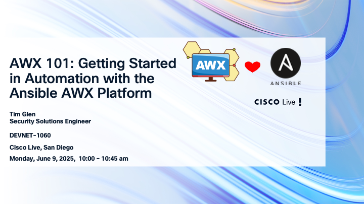

# 2025 Cisco Live San Diego

Welcome to the repository for “AWX 101: Getting Started in Automation with the Ansible AWX Platform” presented at Cisco Live San Diego! This session (Code: DEVNET-1060) is designed to help you take your first steps into automation with AWX, the powerful open-source automation platform built for managing Ansible tasks and workflows.

During this session, we’ll cover the we will learn some basic AWX topics like:

• Building an Inventory: Learn how to define and manage your infrastructure resources in AWX.

• Creating a GitHub-Based Project: Discover how to integrate AWX with source control for seamless automation workflows.

• Running Playbooks: Execute Ansible playbooks to configure, deploy, and manage your infrastructure.

This repository contains the resources, examples, and playbooks used during the session. Feel free to clone or fork the repository to follow along during the presentation or revisit the materials afterward. Whether you’re just starting your automation journey or looking to enhance your skills, this session provides the foundational knowledge needed to leverage AWX effectively in your environment.

Let’s automate together! 🚀

Thanks to ChatGPT for helping with this README file! Tim
